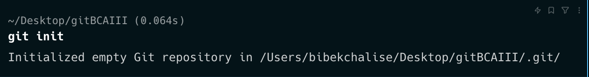
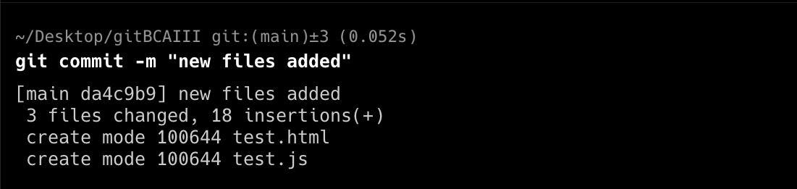
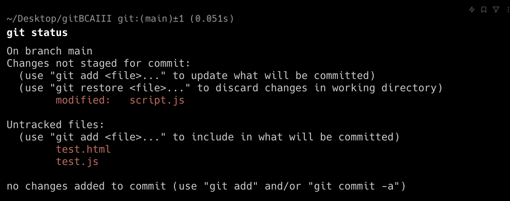
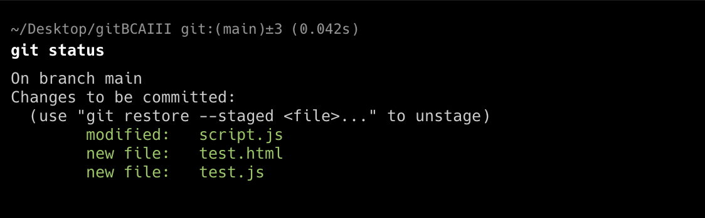
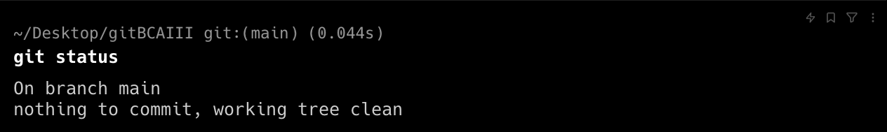

# Git Commands

* Make a new folder named: gitBCAIII
  ``` bash
  mkdir gitBCAIII
  ```

* go to that folder
 ```bash
cd gitBCAIII
```

* git initialization in a folder
```bash

git init 
```



Steps in git
* Make changes -> Done
```bash

touch filename.txt
```
* add changes -> Done
```bash

git add filename.txt 
#multiple add
git add .
```

* commit changes
```bash

git commit -m "initial commit" 
```


* git status -> to know the status of files and working tree
```bash
git status
```
Different possible outputs.






