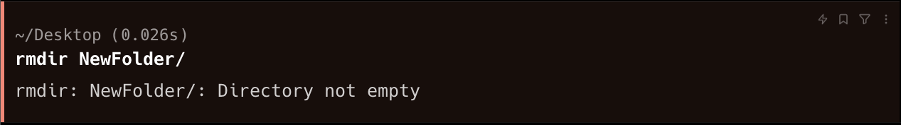

# List of Linux Commands

* ls  - > List all of the files and folders
```bash 
ls
```
* ls  - > List all of the files and folders including hidden files and folders.
```bash 
ls -a
```
* pwd -> present working directory, show the current working directory path
```bash 
pwd
```
* cd -> Change the working directory
```bash 
cd FolderName
```
* cd -> Change the working directory one step back
```bash 
cd ..
```
* clear  -> Clear the output of the terminal
```bash
clear
```
* cat  -> Read the text file
```bash
cat filename.txt
```
* touch  -> create new file
```bash 
touch test.txt
```
* echo -> Helps to write text in the file
```bash 
echo "This is a test line" > test.txt
echo "This is a test line" >>  test.txt
# >> this appends the data 
#  > This overwrites the data
```
* mkdir -> Make a new directory
```bash 
mkdir NewFolder
```
*rmdir -> Remvoe the directory
```bash 
rmdir NewFolder
```


if the folder is not empty
```bash 
rm -rf NewFolder
```

* nano -> Editor in commnad line
```bash 
nano 
nano filename.extension

# To exit from name
#save
ctrl + o
#exit
ctrl + x
```